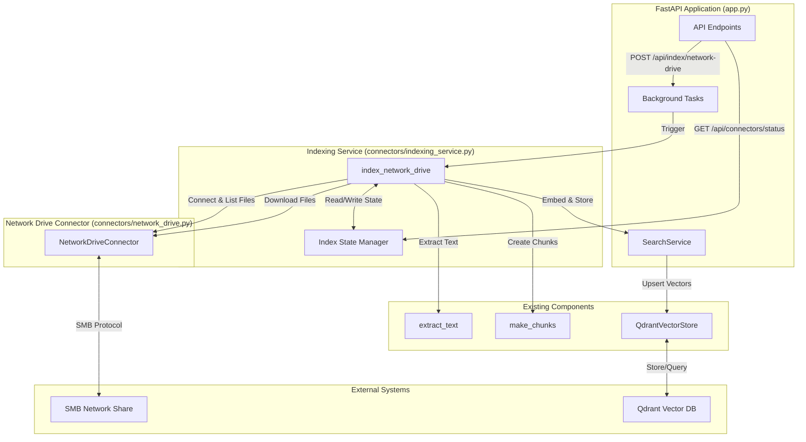

# Design Document: Network Drive Connector

## Overview

This design document specifies the technical implementation for adding SMB network drive connector functionality to KnowledgeOS. The system will enable secure connections to Windows network shares using the SMB protocol, discover and index supported document files (.pdf, .docx, .xlsx, .txt, .csv), track file modification times to enable incremental indexing, and provide API endpoints for triggering indexing operations and monitoring connector status.

The implementation integrates seamlessly with the existing KnowledgeOS architecture, reusing the text extraction pipeline (`extract_text`, `make_chunks`), the Qdrant vector store (`QdrantVectorStore`), and the embedding model managed by `SearchService`. The design follows the established patterns in `app.py` for background task management and API endpoint structure.

### Key Design Decisions

1. **SMB Library Selection**: Use `smbprotocol` library ([https://github.com/jborean93/smbprotocol](https://github.com/jborean93/smbprotocol)) for SMB protocol implementation. This library provides pure Python implementation of SMBv2 and SMBv3 protocols, requires no external dependencies, and offers a high-level API similar to Python's `os` module for file operations.

2. **Incremental Indexing Strategy**: Track file modification timestamps in a JSON state file (`index_state.json`) to avoid re-processing unchanged files. This significantly reduces indexing time for large network shares.

3. **Source Tagging**: Add `source: "network_drive"` metadata to all chunks indexed from network drives, enabling filtered searches and selective deletion of network drive content.

4. **Background Task Pattern**: Follow the existing `crawl_tasks` pattern in `app.py` for asynchronous indexing operations with progress tracking and status polling.

5. **Error Resilience**: Implement graceful error handling at each stage (connection, file discovery, download, extraction) to ensure partial failures don't crash the entire indexing operation.

## Architecture

### High-Level Component Diagram



### Data Flow

1. **Indexing Trigger**: User or system triggers indexing via POST `/api/index/network-drive`
2. **Background Task Creation**: FastAPI creates background task with unique `task_id`
3. **Connection Establishment**: `NetworkDriveConnector` establishes SMB connection using credentials from environment variables
4. **File Discovery**: Connector recursively traverses network share, filtering for supported file extensions
5. **Incremental Check**: For each discovered file, compare modification timestamp against `index_state.json`
6. **File Processing**: Download new/modified files to local cache, extract text, create chunks
7. **Vector Generation**: Use `SearchService` embedding model to generate vectors for chunks
8. **Vector Storage**: Upsert chunks and vectors to Qdrant with `source: "network_drive"` metadata
9. **State Update**: Update `index_state.json` with new timestamps for processed files
10. **Status Reporting**: Update task status for polling via GET `/api/crawl/status/{task_id}`

## Components and Interfaces

### Component 1: NetworkDriveConnector

**File**: `connectors/network_drive.py`

**Purpose**: Manages SMB connections and file operations on network shares.

**Class Definition**:

```python
class NetworkDriveConnector:
    """
    Manages SMB connections and file operations for network drives.
    
    Uses smbprotocol library for SMBv2/v3 protocol implementation.
    """
    
    def __init__(
        self,
        host: str,
        share: str,
        username: str,
        password: str,
        domain: str = ""
    ):
        """
        Initialize connector with connection parameters.
        
        Args:
            host: SMB server hostname or IP address
            share: Share name (e.g., "Documents")
            username: Authentication username
            password: Authentication password
            domain: Windows domain (optional, defaults to "")
        """
        
    def connect(self) -> bool:
        """
        Establish SMB connection to the network share.
        
        Returns:
            True if connection successful, False otherwise
        """
        
    def disconnect(self) -> None:
        """Close the active SMB connection."""
        
    def list_files(
        self,
        remote_path: str = "/",
        extensions: Optional[set[str]] = None
    ) -> list[str]:
        """
        Recursively list all files matching specified extensions.
        
        Args:
            remote_path: Starting path on the share (default: "/")
            extensions: Set of file extensions to include (default: {.pdf, .docx, .xlsx, .txt, .csv})
            
        Returns:
            List of full SMB paths for matching files
        """
        
    def download_file(
        self,
        remote_path: str,
        local_cache_dir: str
    ) -> Optional[str]:
        """
        Download a file from the network share to local cache.
        
        Args:
            remote_path: Full path to file on network share
            local_cache_dir: Local directory for caching downloaded files
            
        Returns:
            Local file path if successful, None if download fails
        """
        
    def get_file_modified_time(
        self,
        remote_path: str
    ) -> Optional[datetime]:
        """
        Get the last modified timestamp for a file.
        
        Args:
            remote_path: Full path to file on network share
            
        Returns:
            datetime object with last modified time, or None if query fails
        """
```

**Implementation Notes**:

- Use `smbclient` module from `smbprotocol` library for high-level file operations
- Connection format: `\\\\{host}\\{share}\\{path}`
- Use `smbclient.register_session()` to establish authenticated session
- Use `smbclient.listdir()` for directory traversal
- Use `smbclient.stat()` to get file metadata including modification time
- Use `smbclient.open()` with binary mode for file downloads
- Implement comprehensive error handling with logging for all SMB operations
- Default extensions: `{".pdf", ".docx", ".xlsx", ".txt", ".csv"}`

**Error Handling**:

- Connection failures: Log error with details, return False from `connect()`
- Access denied errors: Log warning, skip inaccessible directories/files
- Network timeouts: Log error, return None or empty list as appropriate
- File not found: Log warning, return None

### Component 2: Indexing Service

**File**: `connectors/indexing_service.py`

**Purpose**: Orchestrates the complete indexing pipeline from file discovery to vector storage.

**Function Definition**:

```python
def index_network_drive(
    connector: NetworkDriveConnector,
    search_service: SearchService,
    cache_dir: str = "./data/network_drive_cache",
    remote_path: str = "/"
) -> dict:
    """
    Index all supported files from a network drive.
    
    This function orchestrates the complete indexing pipeline:
    1. Load index state from JSON file
    2. Connect to network drive
    3. Discover files recursively
    4. Filter files based on modification timestamps (incremental indexing)
    5. Download, extract text, chunk, embed, and store vectors
    6. Update index state
    7. Return summary statistics
    
    Args:
        connector: NetworkDriveConnector instance with credentials
        search_service: SearchService instance for embeddings
        cache_dir: Local directory for caching files and state
        remote_path: Starting path on the network share
        
    Returns:
        Dictionary with indexing summary:
        {
            "total_discovered": int,
            "indexed": int,
            "skipped": int,
            "failed": int,
            "total_chunks": int,
            "elapsed_seconds": float
        }
    """
```

**Implementation Steps**:

1. **Setup**:
   - Create cache directory if it doesn't exist: `os.makedirs(cache_dir, exist_ok=True)`
   - Load index state from `{cache_dir}/index_state.json`
   - Initialize counters: `indexed=0, skipped=0, failed=0`

2. **Connection**:
   - Call `connector.connect()`
   - If connection fails, return error summary immediately

3. **File Discovery**:
   - Call `connector.list_files(remote_path)`
   - Log total number of discovered files

4. **Incremental Processing Loop**:
   ```python
   for remote_file_path in discovered_files:
       # Get modification time
       mod_time = connector.get_file_modified_time(remote_file_path)
       
       # Check against index state
       last_indexed = index_state.get(remote_file_path)
       if last_indexed and mod_time <= last_indexed:
           skipped += 1
           continue
       
       # Download file
       local_path = connector.download_file(remote_file_path, cache_dir)
       if not local_path:
           failed += 1
           continue
       
       # Extract text
       try:
           pages = extract_text(local_path)
       except Exception as e:
           logger.error(f"Text extraction failed for {remote_file_path}: {e}")
           failed += 1
           continue
       
       # Create chunks with source="network_drive"
       chunks = make_chunks(pages, remote_file_path, Path(local_path).suffix.upper().strip("."))
       for chunk in chunks:
           chunk["source"] = "network_drive"
       
       # Delete old vectors for this file
       search_service.vector_store.delete_by_source(f"network_drive:{remote_file_path}")
       
       # Embed and store
       texts = [c["text"] for c in chunks]
       vectors = search_service.model.encode(texts, show_progress_bar=False)
       search_service.update(np.array(vectors, dtype=np.float32), chunks)
       
       # Update state
       index_state[remote_file_path] = mod_time.isoformat()
       indexed += 1
   ```

5. **Cleanup**:
   - Save updated index state to JSON file
   - Disconnect from network drive
   - Return summary dictionary

**Index State Management**:

```python
def load_index_state(cache_dir: str) -> dict:
    """Load index state from JSON file."""
    state_file = os.path.join(cache_dir, "index_state.json")
    if os.path.exists(state_file):
        with open(state_file, "r") as f:
            return json.load(f)
    return {}

def save_index_state(cache_dir: str, state: dict) -> None:
    """Save index state to JSON file."""
    state_file = os.path.join(cache_dir, "index_state.json")
    with open(state_file, "w") as f:
        json.dump(state, f, indent=2)
```

### Component 3: Vector Store Integration

**Modification**: Extend `QdrantVectorStore.delete_by_source()` to support file-specific deletion.

**Current Implementation**:
```python
def delete_by_source(self, source: str) -> None:
    """Delete all points with a specific source value."""
```

**Enhancement Needed**:

The current implementation deletes all points matching a source value. For network drive re-indexing, we need to delete vectors for a specific file. We'll use a composite source identifier:

```python
# When creating chunks in indexing_service.py
chunk["source"] = "network_drive"
chunk["file_path"] = remote_file_path  # Already exists

# When deleting before re-indexing
# Use file_path filter instead of source filter
```

**Alternative Approach** (Recommended):

Use the existing `file_path` field for deletion filtering. Modify the deletion call in `indexing_service.py`:

```python
# Delete old vectors for this specific file
from qdrant_client.models import Filter, FieldCondition, MatchValue

self.client.delete(
    collection_name=self.collection_name,
    points_selector=Filter(
        must=[
            FieldCondition(
                key="file_path",
                match=MatchValue(value=remote_file_path)
            )
        ]
    )
)
```

This approach requires no changes to `QdrantVectorStore` class.

## Data Models

### Index State JSON Structure

**File**: `{cache_dir}/index_state.json`

**Purpose**: Track last indexed timestamp for each file to enable incremental indexing.

**Schema**:

```json
{
  "//server/share/path/to/document1.pdf": "2025-01-15T14:30:00",
  "//server/share/path/to/document2.docx": "2025-01-14T09:15:00",
  "//server/share/another/file.xlsx": "2025-01-13T16:45:00"
}
```

**Fields**:
- **Key**: Full SMB path to the file (string)
- **Value**: ISO 8601 timestamp of last indexing operation (string)

**Operations**:
- **Load**: Read JSON file at startup, return empty dict if file doesn't exist
- **Update**: Add/update entry after successful indexing of a file
- **Save**: Write entire dict to JSON file after processing all files

**Consistency Guarantees**:
- Save state only after successful vector upsert
- If indexing fails mid-operation, state file reflects last successful file
- Next indexing run will retry failed files

### Chunk Metadata Structure

**Extension**: Add `source` field to existing chunk metadata.

**Current Structure** (from `app.py`):
```python
{
    "file_path": str,    # Path to the file
    "file_type": str,    # File extension (PDF, DOCX, etc.)
    "page": int,         # Page number
    "chunk_index": int,  # Sequential chunk number
    "text": str,         # Chunk text content
    "source": str        # NEW: "local" or "network_drive"
}
```

**Network Drive Chunks**:
```python
{
    "file_path": "//server/share/docs/report.pdf",
    "file_type": "PDF",
    "page": 1,
    "chunk_index": 0,
    "text": "This is the content...",
    "source": "network_drive"  # Identifies origin
}
```

**Usage**:
- Filter searches by source: `sources=["network_drive"]` in `vector_store.search()`
- Delete network drive content: `vector_store.delete_by_source("network_drive")`
- Distinguish local vs. network files in search results

### API Response Models

#### POST /api/index/network-drive Response

```json
{
  "task_id": "550e8400-e29b-41d4-a716-446655440000",
  "status": "queued"
}
```

**Error Response** (when NETWORK_DRIVE_ENABLED=false):
```json
{
  "error": "Network drive connector is not enabled. Set NETWORK_DRIVE_ENABLED=true in .env"
}
```

#### GET /api/crawl/status/{task_id} Response

**Queued State**:
```json
{
  "task_id": "550e8400-e29b-41d4-a716-446655440000",
  "status": "queued",
  "message": "Queued"
}
```

**Running State**:
```json
{
  "task_id": "550e8400-e29b-41d4-a716-446655440000",
  "status": "running",
  "message": "Processing 15/42 files",
  "total_discovered": 42,
  "files_processed": 15,
  "total_chunks": 387,
  "indexed": 12,
  "skipped": 3,
  "failed": 0
}
```

**Complete State**:
```json
{
  "task_id": "550e8400-e29b-41d4-a716-446655440000",
  "status": "complete",
  "message": "Indexed 42 files, 1250 chunks",
  "total_discovered": 42,
  "indexed": 38,
  "skipped": 3,
  "failed": 1,
  "total_chunks": 1250,
  "elapsed_seconds": 127.5
}
```

**Error State**:
```json
{
  "task_id": "550e8400-e29b-41d4-a716-446655440000",
  "status": "error",
  "message": "Connection failed: Unable to reach //server/share"
}
```

#### GET /api/connectors/status Response

```json
{
  "connectors": {
    "local": {
      "enabled": true,
      "last_indexed": "2025-01-15T14:30:00Z",
      "total_files": 156,
      "total_chunks": 4523
    },
    "network_drive": {
      "enabled": true,
      "last_indexed": "2025-01-15T16:45:00Z",
      "total_files": 42,
      "total_chunks": 1250,
      "host": "fileserver.company.com",
      "share": "Documents"
    }
  }
}
```

**When Network Drive Not Configured**:
```json
{
  "connectors": {
    "local": {
      "enabled": true,
      "last_indexed": "2025-01-15T14:30:00Z",
      "total_files": 156,
      "total_chunks": 4523
    },
    "network_drive": {
      "enabled": false,
      "message": "Not configured. Set NETWORK_DRIVE_ENABLED=true and provide credentials in .env"
    }
  }
}
```


## API Endpoints

### Endpoint 1: Trigger Network Drive Indexing

**Route**: `POST /api/index/network-drive`

**Purpose**: Initiate background indexing of network drive files.

**Request**:
- Method: POST
- Headers: None required
- Body: None (configuration from environment variables)

**Response**:
- Success (200):
  ```json
  {
    "task_id": "550e8400-e29b-41d4-a716-446655440000",
    "status": "queued"
  }
  ```
- Error (400):
  ```json
  {
    "error": "Network drive connector is not enabled. Set NETWORK_DRIVE_ENABLED=true in .env"
  }
  ```

**Implementation** (in `app.py`):

```python
@app.post("/api/index/network-drive")
async def index_network_drive_endpoint(background_tasks: BackgroundTasks):
    """Trigger network drive indexing as a background task."""
    
    # Check if network drive is enabled
    enabled = os.getenv("NETWORK_DRIVE_ENABLED", "false").lower() == "true"
    if not enabled:
        return {
            "error": "Network drive connector is not enabled. Set NETWORK_DRIVE_ENABLED=true in .env"
        }, 400
    
    # Validate required environment variables
    host = os.getenv("NETWORK_DRIVE_HOST")
    share = os.getenv("NETWORK_DRIVE_SHARE")
    username = os.getenv("NETWORK_DRIVE_USERNAME")
    password = os.getenv("NETWORK_DRIVE_PASSWORD")
    
    if not all([host, share, username, password]):
        return {
            "error": "Missing required environment variables. Check NETWORK_DRIVE_HOST, NETWORK_DRIVE_SHARE, NETWORK_DRIVE_USERNAME, NETWORK_DRIVE_PASSWORD"
        }, 400
    
    # Create task
    task_id = str(uuid.uuid4())
    crawl_tasks[task_id] = {
        "status": "queued",
        "message": "Queued",
        "total_discovered": 0,
        "files_processed": 0,
        "indexed": 0,
        "skipped": 0,
        "failed": 0,
        "total_chunks": 0,
    }
    
    # Start background task
    background_tasks.add_task(
        background_index_network_drive,
        task_id,
        host,
        share,
        username,
        password,
        os.getenv("NETWORK_DRIVE_DOMAIN", ""),
        _svc()
    )
    
    logger.info(f"Network drive indexing task queued: {task_id}")
    return {"task_id": task_id, "status": "queued"}
```

**Background Task Function**:

```python
def background_index_network_drive(
    task_id: str,
    host: str,
    share: str,
    username: str,
    password: str,
    domain: str,
    search_svc: SearchService
) -> None:
    """Background task for network drive indexing."""
    from connectors.network_drive import NetworkDriveConnector
    from connectors.indexing_service import index_network_drive
    
    task = crawl_tasks[task_id]
    
    try:
        task["status"] = "running"
        task["message"] = f"Connecting to //{host}/{share}"
        logger.info(f"[task:{task_id}] Starting network drive indexing")
        
        # Create connector
        connector = NetworkDriveConnector(host, share, username, password, domain)
        
        # Run indexing
        cache_dir = os.path.join(DATA_DIR, "network_drive_cache")
        summary = index_network_drive(
            connector,
            search_svc,
            cache_dir,
            remote_path="/"
        )
        
        # Update task with results
        task["status"] = "complete"
        task["message"] = f"Indexed {summary['indexed']} files, {summary['total_chunks']} chunks"
        task.update(summary)
        
        logger.info(f"[task:{task_id}] Network drive indexing complete: {summary}")
        
    except Exception as exc:
        task["status"] = "error"
        task["message"] = f"Indexing failed: {exc}"
        logger.exception(f"[task:{task_id}] Network drive indexing failed")
```

### Endpoint 2: Get Connector Status

**Route**: `GET /api/connectors/status`

**Purpose**: Retrieve status information for all connectors (local and network drive).

**Request**:
- Method: GET
- Headers: None required
- Query Parameters: None

**Response**:
- Success (200):
  ```json
  {
    "connectors": {
      "local": {
        "enabled": true,
        "last_indexed": "2025-01-15T14:30:00Z",
        "total_files": 156,
        "total_chunks": 4523
      },
      "network_drive": {
        "enabled": true,
        "last_indexed": "2025-01-15T16:45:00Z",
        "total_files": 42,
        "total_chunks": 1250,
        "host": "fileserver.company.com",
        "share": "Documents"
      }
    }
  }
  ```

**Implementation** (in `app.py`):

```python
@app.get("/api/connectors/status")
def get_connectors_status():
    """Get status of all connectors."""
    svc = _svc()
    
    # Get stats from Qdrant
    status = {
        "connectors": {
            "local": {},
            "network_drive": {}
        }
    }
    
    # Local connector status
    try:
        # Query Qdrant for local source stats
        from qdrant_client.models import Filter, FieldCondition, MatchValue
        
        scroll_result = svc.vector_store.client.scroll(
            collection_name=svc.vector_store.collection_name,
            scroll_filter=Filter(
                must=[
                    FieldCondition(
                        key="source",
                        match=MatchValue(value="local")
                    )
                ]
            ),
            limit=10000,
            with_payload=True,
            with_vectors=False
        )
        
        local_files = set()
        local_chunks = 0
        for point in scroll_result[0]:
            local_chunks += 1
            local_files.add(point.payload.get("file_path", ""))
        
        status["connectors"]["local"] = {
            "enabled": True,
            "total_files": len(local_files),
            "total_chunks": local_chunks
        }
        
    except Exception as e:
        logger.error(f"Failed to get local connector stats: {e}")
        status["connectors"]["local"] = {
            "enabled": True,
            "total_files": 0,
            "total_chunks": 0
        }
    
    # Network drive connector status
    enabled = os.getenv("NETWORK_DRIVE_ENABLED", "false").lower() == "true"
    
    if not enabled:
        status["connectors"]["network_drive"] = {
            "enabled": False,
            "message": "Not configured. Set NETWORK_DRIVE_ENABLED=true and provide credentials in .env"
        }
    else:
        try:
            # Query Qdrant for network_drive source stats
            scroll_result = svc.vector_store.client.scroll(
                collection_name=svc.vector_store.collection_name,
                scroll_filter=Filter(
                    must=[
                        FieldCondition(
                            key="source",
                            match=MatchValue(value="network_drive")
                        )
                    ]
                ),
                limit=10000,
                with_payload=True,
                with_vectors=False
            )
            
            nd_files = set()
            nd_chunks = 0
            for point in scroll_result[0]:
                nd_chunks += 1
                nd_files.add(point.payload.get("file_path", ""))
            
            # Load index state to get last indexed time
            cache_dir = os.path.join(DATA_DIR, "network_drive_cache")
            state_file = os.path.join(cache_dir, "index_state.json")
            last_indexed = None
            
            if os.path.exists(state_file):
                with open(state_file, "r") as f:
                    state = json.load(f)
                    if state:
                        # Get most recent timestamp
                        timestamps = [datetime.fromisoformat(ts) for ts in state.values()]
                        last_indexed = max(timestamps).isoformat() + "Z"
            
            status["connectors"]["network_drive"] = {
                "enabled": True,
                "total_files": len(nd_files),
                "total_chunks": nd_chunks,
                "host": os.getenv("NETWORK_DRIVE_HOST", ""),
                "share": os.getenv("NETWORK_DRIVE_SHARE", "")
            }
            
            if last_indexed:
                status["connectors"]["network_drive"]["last_indexed"] = last_indexed
            
        except Exception as e:
            logger.error(f"Failed to get network drive connector stats: {e}")
            status["connectors"]["network_drive"] = {
                "enabled": True,
                "total_files": 0,
                "total_chunks": 0,
                "host": os.getenv("NETWORK_DRIVE_HOST", ""),
                "share": os.getenv("NETWORK_DRIVE_SHARE", "")
            }
    
    return status
```

### Endpoint 3: Reuse Existing Status Polling

**Route**: `GET /api/crawl/status/{task_id}`

**Purpose**: Poll progress of network drive indexing task (reuses existing endpoint).

**Implementation**: No changes needed. The existing endpoint in `app.py` already supports polling any task in the `crawl_tasks` dictionary.

## Environment Configuration

### New Environment Variables

Add the following variables to `.env`:

```bash
# Network Drive Connector Configuration
NETWORK_DRIVE_ENABLED=false
NETWORK_DRIVE_HOST=fileserver.company.com
NETWORK_DRIVE_SHARE=Documents
NETWORK_DRIVE_USERNAME=service_account
NETWORK_DRIVE_PASSWORD=secure_password_here
NETWORK_DRIVE_DOMAIN=COMPANY
```

**Variable Descriptions**:

| Variable | Required | Default | Description |
|----------|----------|---------|-------------|
| `NETWORK_DRIVE_ENABLED` | No | `false` | Enable/disable network drive connector |
| `NETWORK_DRIVE_HOST` | Yes* | - | SMB server hostname or IP address |
| `NETWORK_DRIVE_SHARE` | Yes* | - | Share name (e.g., "Documents") |
| `NETWORK_DRIVE_USERNAME` | Yes* | - | Authentication username |
| `NETWORK_DRIVE_PASSWORD` | Yes* | - | Authentication password |
| `NETWORK_DRIVE_DOMAIN` | No | `""` | Windows domain for authentication |

*Required when `NETWORK_DRIVE_ENABLED=true`

### Configuration Loading

Add to `app.py` after existing config loading:

```python
# Network Drive Configuration
NETWORK_DRIVE_ENABLED = os.getenv("NETWORK_DRIVE_ENABLED", "false").lower() == "true"
NETWORK_DRIVE_HOST = os.getenv("NETWORK_DRIVE_HOST", "")
NETWORK_DRIVE_SHARE = os.getenv("NETWORK_DRIVE_SHARE", "")
NETWORK_DRIVE_USERNAME = os.getenv("NETWORK_DRIVE_USERNAME", "")
NETWORK_DRIVE_PASSWORD = os.getenv("NETWORK_DRIVE_PASSWORD", "")
NETWORK_DRIVE_DOMAIN = os.getenv("NETWORK_DRIVE_DOMAIN", "")
NETWORK_DRIVE_CACHE_DIR = os.path.join(DATA_DIR, "network_drive_cache")
```

## Error Handling

### Error Categories and Strategies

#### 1. Connection Errors

**Scenarios**:
- Network unreachable
- Invalid hostname/IP
- Firewall blocking SMB ports (445, 139)
- Authentication failure

**Handling**:
```python
try:
    success = connector.connect()
    if not success:
        task["status"] = "error"
        task["message"] = "Failed to connect to network drive. Check credentials and network connectivity."
        return
except Exception as e:
    logger.error(f"Connection error: {e}")
    task["status"] = "error"
    task["message"] = f"Connection error: {str(e)}"
    return
```

**User-Facing Message**: "Failed to connect to network drive. Check credentials and network connectivity."

#### 2. File Discovery Errors

**Scenarios**:
- Access denied to specific directories
- Network timeout during traversal
- Share becomes unavailable mid-discovery

**Handling**:
```python
try:
    files = connector.list_files(remote_path)
except PermissionError as e:
    logger.warning(f"Access denied to {remote_path}: {e}")
    # Continue with accessible files
    files = []
except Exception as e:
    logger.error(f"File discovery error: {e}")
    task["status"] = "error"
    task["message"] = f"File discovery failed: {str(e)}"
    return
```

**User-Facing Message**: "File discovery completed with some access restrictions. Check logs for details."

#### 3. File Download Errors

**Scenarios**:
- File locked by another process
- Network interruption during download
- Insufficient local disk space

**Handling**:
```python
try:
    local_path = connector.download_file(remote_path, cache_dir)
    if not local_path:
        logger.warning(f"Failed to download {remote_path}")
        failed += 1
        continue  # Continue with next file
except Exception as e:
    logger.error(f"Download error for {remote_path}: {e}")
    failed += 1
    continue  # Continue with next file
```

**User-Facing Message**: Included in summary: "Failed: 3 files"

#### 4. Text Extraction Errors

**Scenarios**:
- Corrupted file
- Unsupported file format variant
- Password-protected document

**Handling**:
```python
try:
    pages = extract_text(local_path)
except Exception as e:
    logger.error(f"Text extraction failed for {remote_path}: {e}")
    failed += 1
    continue  # Continue with next file
```

**User-Facing Message**: Included in summary: "Failed: 3 files"

#### 5. Vector Storage Errors

**Scenarios**:
- Qdrant connection lost
- Disk full on Qdrant server
- Invalid vector dimensions

**Handling**:
```python
try:
    search_service.update(vectors, chunks)
except Exception as e:
    logger.error(f"Vector storage failed for {remote_path}: {e}")
    failed += 1
    # Do NOT update index state for this file
    continue  # Continue with next file
```

**User-Facing Message**: Included in summary: "Failed: 3 files"

### Index State Consistency

**Critical Requirement**: Only update `index_state.json` after successful vector upsert.

**Implementation**:
```python
# Process file
try:
    # Download, extract, chunk, embed
    vectors = search_service.model.encode(texts)
    search_service.update(vectors, chunks)
    
    # Only update state after successful upsert
    index_state[remote_path] = mod_time.isoformat()
    indexed += 1
    
except Exception as e:
    logger.error(f"Processing failed for {remote_path}: {e}")
    failed += 1
    # State NOT updated - file will be retried next time
```

**Guarantee**: If indexing is interrupted (crash, network failure, user cancellation), the next run will retry all files that weren't successfully indexed.

### Logging Strategy

**Log Levels**:
- `INFO`: Normal operations (connection established, file processed, indexing complete)
- `WARNING`: Recoverable errors (access denied to directory, file download failed)
- `ERROR`: Serious errors (connection failed, vector storage failed)

**Log Format**:
```python
logger.info(f"[task:{task_id}] Connected to //{host}/{share}")
logger.info(f"[task:{task_id}] Discovered {len(files)} files")
logger.info(f"[task:{task_id}] Processed {remote_path} → {len(chunks)} chunks")
logger.warning(f"[task:{task_id}] Access denied: {directory_path}")
logger.error(f"[task:{task_id}] Connection failed: {error_message}")
```


## Testing Strategy

### Property-Based Testing Applicability Assessment

**Is PBT appropriate for this feature?**

This feature involves:
1. **External I/O operations**: SMB network connections, file downloads, network share traversal
2. **Side-effect-heavy operations**: File system operations, network communication, database writes
3. **Infrastructure integration**: Qdrant vector store, SMB file servers
4. **Configuration-dependent behavior**: Credentials, network availability, file permissions

**Conclusion**: Property-based testing is **NOT appropriate** for this feature.

**Rationale**:
- The core functionality involves external dependencies (SMB servers, Qdrant) that cannot be meaningfully tested with property-based approaches
- File operations and network communication are inherently side-effect-based with no pure input/output transformations
- The behavior is heavily dependent on external state (network availability, file permissions, server configuration)
- Testing would require extensive mocking that defeats the purpose of PBT

**Recommended Testing Approach**: Use **unit tests with mocks** for component logic and **integration tests** for end-to-end workflows.

### Testing Approach

#### Unit Tests

**Purpose**: Test individual component logic in isolation using mocks for external dependencies.

**Test Suite 1: NetworkDriveConnector Tests**

File: `tests/test_network_drive_connector.py`

```python
import unittest
from unittest.mock import Mock, patch, MagicMock
from connectors.network_drive import NetworkDriveConnector

class TestNetworkDriveConnector(unittest.TestCase):
    
    def test_init_stores_credentials(self):
        """Test that __init__ stores connection parameters without connecting."""
        connector = NetworkDriveConnector(
            host="testserver",
            share="testshare",
            username="testuser",
            password="testpass",
            domain="TESTDOMAIN"
        )
        self.assertEqual(connector.host, "testserver")
        self.assertEqual(connector.share, "testshare")
        self.assertEqual(connector.username, "testuser")
        self.assertEqual(connector.domain, "TESTDOMAIN")
    
    @patch('smbclient.register_session')
    def test_connect_success(self, mock_register):
        """Test successful SMB connection."""
        mock_register.return_value = None
        connector = NetworkDriveConnector("host", "share", "user", "pass")
        result = connector.connect()
        self.assertTrue(result)
        mock_register.assert_called_once()
    
    @patch('smbclient.register_session')
    def test_connect_failure(self, mock_register):
        """Test connection failure handling."""
        mock_register.side_effect = Exception("Connection refused")
        connector = NetworkDriveConnector("host", "share", "user", "pass")
        result = connector.connect()
        self.assertFalse(result)
    
    @patch('smbclient.listdir')
    @patch('smbclient.stat')
    def test_list_files_filters_extensions(self, mock_stat, mock_listdir):
        """Test that list_files filters by file extensions."""
        # Mock directory structure
        mock_listdir.side_effect = [
            ["file1.pdf", "file2.txt", "file3.jpg", "subdir"],
            []  # subdir is empty
        ]
        mock_stat.return_value = Mock(st_mode=0o040000)  # Directory mode
        
        connector = NetworkDriveConnector("host", "share", "user", "pass")
        connector.connected = True
        
        files = connector.list_files("/", extensions={".pdf", ".txt"})
        
        # Should include .pdf and .txt, exclude .jpg
        self.assertIn("file1.pdf", [f.split("/")[-1] for f in files])
        self.assertIn("file2.txt", [f.split("/")[-1] for f in files])
        self.assertNotIn("file3.jpg", [f.split("/")[-1] for f in files])
    
    @patch('smbclient.open')
    def test_download_file_success(self, mock_open):
        """Test successful file download."""
        mock_file = MagicMock()
        mock_file.read.return_value = b"file content"
        mock_open.return_value.__enter__.return_value = mock_file
        
        connector = NetworkDriveConnector("host", "share", "user", "pass")
        connector.connected = True
        
        local_path = connector.download_file("//host/share/test.pdf", "/tmp/cache")
        
        self.assertIsNotNone(local_path)
        self.assertTrue(local_path.endswith("test.pdf"))
    
    @patch('smbclient.open')
    def test_download_file_failure(self, mock_open):
        """Test download failure handling."""
        mock_open.side_effect = Exception("File not found")
        
        connector = NetworkDriveConnector("host", "share", "user", "pass")
        connector.connected = True
        
        local_path = connector.download_file("//host/share/missing.pdf", "/tmp/cache")
        
        self.assertIsNone(local_path)
    
    @patch('smbclient.stat')
    def test_get_file_modified_time(self, mock_stat):
        """Test retrieving file modification time."""
        from datetime import datetime
        mock_stat.return_value = Mock(st_mtime=1705334400.0)  # 2025-01-15 12:00:00
        
        connector = NetworkDriveConnector("host", "share", "user", "pass")
        connector.connected = True
        
        mod_time = connector.get_file_modified_time("//host/share/test.pdf")
        
        self.assertIsNotNone(mod_time)
        self.assertIsInstance(mod_time, datetime)
```

**Test Suite 2: Indexing Service Tests**

File: `tests/test_indexing_service.py`

```python
import unittest
from unittest.mock import Mock, patch, MagicMock
from connectors.indexing_service import index_network_drive, load_index_state, save_index_state
import tempfile
import os
import json

class TestIndexingService(unittest.TestCase):
    
    def test_load_index_state_empty(self):
        """Test loading index state when file doesn't exist."""
        with tempfile.TemporaryDirectory() as tmpdir:
            state = load_index_state(tmpdir)
            self.assertEqual(state, {})
    
    def test_load_index_state_existing(self):
        """Test loading existing index state."""
        with tempfile.TemporaryDirectory() as tmpdir:
            state_file = os.path.join(tmpdir, "index_state.json")
            test_state = {"//server/file.pdf": "2025-01-15T12:00:00"}
            with open(state_file, "w") as f:
                json.dump(test_state, f)
            
            state = load_index_state(tmpdir)
            self.assertEqual(state, test_state)
    
    def test_save_index_state(self):
        """Test saving index state to file."""
        with tempfile.TemporaryDirectory() as tmpdir:
            test_state = {"//server/file.pdf": "2025-01-15T12:00:00"}
            save_index_state(tmpdir, test_state)
            
            state_file = os.path.join(tmpdir, "index_state.json")
            self.assertTrue(os.path.exists(state_file))
            
            with open(state_file, "r") as f:
                loaded_state = json.load(f)
            self.assertEqual(loaded_state, test_state)
    
    @patch('connectors.indexing_service.extract_text')
    @patch('connectors.indexing_service.make_chunks')
    def test_index_network_drive_incremental_skip(self, mock_chunks, mock_extract):
        """Test that unchanged files are skipped during incremental indexing."""
        from datetime import datetime
        
        # Mock connector
        mock_connector = Mock()
        mock_connector.connect.return_value = True
        mock_connector.list_files.return_value = ["//server/file1.pdf"]
        mock_connector.get_file_modified_time.return_value = datetime(2025, 1, 15, 12, 0, 0)
        
        # Mock search service
        mock_search = Mock()
        mock_search.model_loaded = True
        
        with tempfile.TemporaryDirectory() as tmpdir:
            # Create existing state with same timestamp
            state = {"//server/file1.pdf": "2025-01-15T12:00:00"}
            save_index_state(tmpdir, state)
            
            # Run indexing
            summary = index_network_drive(mock_connector, mock_search, tmpdir)
            
            # File should be skipped
            self.assertEqual(summary["skipped"], 1)
            self.assertEqual(summary["indexed"], 0)
            mock_extract.assert_not_called()
    
    @patch('connectors.indexing_service.extract_text')
    @patch('connectors.indexing_service.make_chunks')
    def test_index_network_drive_processes_new_files(self, mock_chunks, mock_extract):
        """Test that new files are processed."""
        from datetime import datetime
        
        # Mock connector
        mock_connector = Mock()
        mock_connector.connect.return_value = True
        mock_connector.list_files.return_value = ["//server/new_file.pdf"]
        mock_connector.get_file_modified_time.return_value = datetime(2025, 1, 15, 12, 0, 0)
        mock_connector.download_file.return_value = "/tmp/new_file.pdf"
        
        # Mock extraction
        mock_extract.return_value = [{"text": "content", "page": 1}]
        mock_chunks.return_value = [
            {"text": "content", "page": 1, "file_path": "//server/new_file.pdf", 
             "file_type": "PDF", "chunk_index": 0}
        ]
        
        # Mock search service
        mock_search = Mock()
        mock_search.model_loaded = True
        mock_search.model.encode.return_value = [[0.1, 0.2, 0.3]]
        mock_search.vector_store = Mock()
        
        with tempfile.TemporaryDirectory() as tmpdir:
            # Run indexing with empty state
            summary = index_network_drive(mock_connector, mock_search, tmpdir)
            
            # File should be indexed
            self.assertEqual(summary["indexed"], 1)
            self.assertEqual(summary["skipped"], 0)
            mock_extract.assert_called_once()
            mock_search.update.assert_called_once()
```

**Test Suite 3: API Endpoint Tests**

File: `tests/test_api_endpoints.py`

```python
import unittest
from fastapi.testclient import TestClient
from unittest.mock import patch, Mock
import os

class TestNetworkDriveEndpoints(unittest.TestCase):
    
    def setUp(self):
        """Set up test client."""
        from app import app
        self.client = TestClient(app)
    
    @patch.dict(os.environ, {"NETWORK_DRIVE_ENABLED": "false"})
    def test_index_endpoint_disabled(self):
        """Test that endpoint returns error when connector is disabled."""
        response = self.client.post("/api/index/network-drive")
        self.assertEqual(response.status_code, 400)
        self.assertIn("not enabled", response.json()["error"])
    
    @patch.dict(os.environ, {
        "NETWORK_DRIVE_ENABLED": "true",
        "NETWORK_DRIVE_HOST": "testserver",
        "NETWORK_DRIVE_SHARE": "testshare",
        "NETWORK_DRIVE_USERNAME": "testuser",
        "NETWORK_DRIVE_PASSWORD": "testpass"
    })
    def test_index_endpoint_creates_task(self):
        """Test that endpoint creates background task when enabled."""
        response = self.client.post("/api/index/network-drive")
        self.assertEqual(response.status_code, 200)
        self.assertIn("task_id", response.json())
        self.assertEqual(response.json()["status"], "queued")
    
    def test_connectors_status_endpoint(self):
        """Test connectors status endpoint returns expected structure."""
        response = self.client.get("/api/connectors/status")
        self.assertEqual(response.status_code, 200)
        data = response.json()
        self.assertIn("connectors", data)
        self.assertIn("local", data["connectors"])
        self.assertIn("network_drive", data["connectors"])
```

#### Integration Tests

**Purpose**: Test end-to-end workflows with real or containerized dependencies.

**Test Suite 4: End-to-End Integration Tests**

File: `tests/integration/test_network_drive_integration.py`

```python
import unittest
import os
from connectors.network_drive import NetworkDriveConnector
from connectors.indexing_service import index_network_drive

@unittest.skipUnless(
    os.getenv("RUN_INTEGRATION_TESTS") == "true",
    "Integration tests disabled. Set RUN_INTEGRATION_TESTS=true to run."
)
class TestNetworkDriveIntegration(unittest.TestCase):
    """
    Integration tests requiring real SMB server and Qdrant instance.
    
    Setup:
    1. Start Qdrant: docker run -p 6333:6333 qdrant/qdrant
    2. Start Samba test server: docker run -p 445:445 dperson/samba
    3. Set environment variables for test credentials
    """
    
    def setUp(self):
        """Set up test environment."""
        self.host = os.getenv("TEST_SMB_HOST", "localhost")
        self.share = os.getenv("TEST_SMB_SHARE", "testshare")
        self.username = os.getenv("TEST_SMB_USERNAME", "testuser")
        self.password = os.getenv("TEST_SMB_PASSWORD", "testpass")
    
    def test_full_indexing_workflow(self):
        """Test complete indexing workflow with real SMB server."""
        # Create connector
        connector = NetworkDriveConnector(
            self.host,
            self.share,
            self.username,
            self.password
        )
        
        # Connect
        success = connector.connect()
        self.assertTrue(success, "Failed to connect to test SMB server")
        
        # List files
        files = connector.list_files("/")
        self.assertIsInstance(files, list)
        
        # Disconnect
        connector.disconnect()
    
    def test_incremental_indexing(self):
        """Test that incremental indexing skips unchanged files."""
        # First run: index all files
        # Second run: verify files are skipped
        # Modify one file
        # Third run: verify only modified file is re-indexed
        pass  # Implement based on test environment setup
```

### Test Coverage Goals

**Target Coverage**: 80% code coverage for new components

**Coverage by Component**:
- `NetworkDriveConnector`: 90% (high priority, core functionality)
- `indexing_service.py`: 85% (high priority, orchestration logic)
- API endpoints: 75% (medium priority, mostly integration)

**Running Tests**:

```bash
# Unit tests only
pytest tests/ -v --ignore=tests/integration

# With coverage
pytest tests/ --cov=connectors --cov-report=html --ignore=tests/integration

# Integration tests (requires test environment)
RUN_INTEGRATION_TESTS=true pytest tests/integration/ -v
```

### Manual Testing Checklist

**Pre-Deployment Verification**:

1. **Connection Testing**:
   - [ ] Connect to SMB server with valid credentials
   - [ ] Verify connection failure with invalid credentials
   - [ ] Verify connection failure with unreachable host
   - [ ] Test with and without domain parameter

2. **File Discovery**:
   - [ ] List files from root of share
   - [ ] List files from subdirectory
   - [ ] Verify filtering by file extensions
   - [ ] Test with empty directory
   - [ ] Test with access-denied directory

3. **Incremental Indexing**:
   - [ ] First run indexes all files
   - [ ] Second run skips all unchanged files
   - [ ] Modify one file, verify only that file is re-indexed
   - [ ] Add new file, verify it is indexed
   - [ ] Delete file from share, verify it remains in index (expected behavior)

4. **Error Handling**:
   - [ ] Disconnect network during indexing, verify graceful failure
   - [ ] Test with corrupted file, verify it's skipped
   - [ ] Test with locked file, verify it's skipped
   - [ ] Fill local disk, verify error handling

5. **API Endpoints**:
   - [ ] POST /api/index/network-drive returns task_id
   - [ ] GET /api/crawl/status/{task_id} shows progress
   - [ ] GET /api/connectors/status shows network drive stats
   - [ ] Verify error response when connector disabled

6. **Search Integration**:
   - [ ] Search returns results from network drive files
   - [ ] Filter search by source="network_drive"
   - [ ] Verify file_path in results shows SMB path


## Integration Points

### Integration Point 1: Text Extraction Pipeline

**Existing Component**: `extract_text()` and `make_chunks()` functions in `app.py`

**Integration Method**: Direct function calls from `indexing_service.py`

**Data Flow**:
```python
# In indexing_service.py
from app import extract_text, make_chunks

# Download file from network drive
local_path = connector.download_file(remote_path, cache_dir)

# Extract text using existing pipeline
pages = extract_text(local_path)

# Create chunks using existing function
chunks = make_chunks(pages, remote_path, file_type)

# Add source metadata
for chunk in chunks:
    chunk["source"] = "network_drive"
```

**Modifications Required**: None. The existing functions work with local file paths, which is exactly what we provide after downloading from the network drive.

**Testing**: Verify that network drive files produce the same chunk structure as local files.

### Integration Point 2: SearchService and Embedding Model

**Existing Component**: `SearchService` class in `app.py`

**Integration Method**: Pass `SearchService` instance to `index_network_drive()` function

**Data Flow**:
```python
# In background_index_network_drive()
search_svc = _svc()  # Get SearchService instance

# Pass to indexing function
summary = index_network_drive(
    connector,
    search_svc,  # SearchService instance
    cache_dir,
    remote_path="/"
)

# Inside index_network_drive()
texts = [chunk["text"] for chunk in chunks]
vectors = search_svc.model.encode(texts, show_progress_bar=False)
search_svc.update(np.array(vectors, dtype=np.float32), chunks)
```

**Modifications Required**: None. The `SearchService` already provides the necessary methods (`model.encode()` and `update()`).

**Testing**: Verify that embeddings are generated correctly and vectors are stored in Qdrant.

### Integration Point 3: QdrantVectorStore

**Existing Component**: `QdrantVectorStore` class in `db/vector_store.py`

**Integration Method**: Access via `SearchService.vector_store`

**Data Flow**:
```python
# Delete old vectors for a file before re-indexing
from qdrant_client.models import Filter, FieldCondition, MatchValue

search_svc.vector_store.client.delete(
    collection_name=search_svc.vector_store.collection_name,
    points_selector=Filter(
        must=[
            FieldCondition(
                key="file_path",
                match=MatchValue(value=remote_file_path)
            )
        ]
    )
)

# Upsert new vectors
search_svc.vector_store.upsert(chunks, vectors)
```

**Modifications Required**: None. The existing `upsert()` and `delete()` methods support our use case.

**Alternative**: Could add a convenience method `delete_by_file_path()` to `QdrantVectorStore`, but not strictly necessary.

**Testing**: Verify that old vectors are deleted and new vectors are inserted correctly.

### Integration Point 4: Background Task Management

**Existing Component**: `crawl_tasks` dictionary and `background_crawl()` pattern in `app.py`

**Integration Method**: Follow the same pattern for network drive indexing

**Data Flow**:
```python
# Create task entry
task_id = str(uuid.uuid4())
crawl_tasks[task_id] = {
    "status": "queued",
    "message": "Queued",
    # ... other fields
}

# Add background task
background_tasks.add_task(
    background_index_network_drive,
    task_id,
    host,
    share,
    username,
    password,
    domain,
    search_svc
)

# Background function updates task status
task = crawl_tasks[task_id]
task["status"] = "running"
task["message"] = "Processing files..."
```

**Modifications Required**: None. The existing pattern is reusable.

**Testing**: Verify that task status updates correctly and can be polled via existing endpoint.

### Integration Point 5: Environment Configuration

**Existing Component**: Environment variable loading in `app.py`

**Integration Method**: Add new variables to `.env` and load them in `app.py`

**Data Flow**:
```python
# In app.py, after existing config loading
NETWORK_DRIVE_ENABLED = os.getenv("NETWORK_DRIVE_ENABLED", "false").lower() == "true"
NETWORK_DRIVE_HOST = os.getenv("NETWORK_DRIVE_HOST", "")
NETWORK_DRIVE_SHARE = os.getenv("NETWORK_DRIVE_SHARE", "")
NETWORK_DRIVE_USERNAME = os.getenv("NETWORK_DRIVE_USERNAME", "")
NETWORK_DRIVE_PASSWORD = os.getenv("NETWORK_DRIVE_PASSWORD", "")
NETWORK_DRIVE_DOMAIN = os.getenv("NETWORK_DRIVE_DOMAIN", "")
```

**Modifications Required**: Add new configuration variables to `app.py`.

**Testing**: Verify that configuration is loaded correctly and endpoint checks `NETWORK_DRIVE_ENABLED`.

## Implementation Checklist

### Phase 1: Core Components

- [ ] Create `connectors/` directory
- [ ] Create `connectors/__init__.py`
- [ ] Implement `connectors/network_drive.py`:
  - [ ] `NetworkDriveConnector.__init__()`
  - [ ] `NetworkDriveConnector.connect()`
  - [ ] `NetworkDriveConnector.disconnect()`
  - [ ] `NetworkDriveConnector.list_files()`
  - [ ] `NetworkDriveConnector.download_file()`
  - [ ] `NetworkDriveConnector.get_file_modified_time()`
- [ ] Implement `connectors/indexing_service.py`:
  - [ ] `load_index_state()`
  - [ ] `save_index_state()`
  - [ ] `index_network_drive()`

### Phase 2: API Integration

- [ ] Add environment variables to `.env`
- [ ] Add configuration loading to `app.py`
- [ ] Implement `background_index_network_drive()` in `app.py`
- [ ] Implement `POST /api/index/network-drive` endpoint
- [ ] Implement `GET /api/connectors/status` endpoint
- [ ] Update `requirements.txt` with `smbprotocol` dependency

### Phase 3: Testing

- [ ] Write unit tests for `NetworkDriveConnector`
- [ ] Write unit tests for `indexing_service`
- [ ] Write unit tests for API endpoints
- [ ] Set up integration test environment (optional)
- [ ] Write integration tests (optional)
- [ ] Run manual testing checklist

### Phase 4: Documentation

- [ ] Update README.md with network drive connector setup instructions
- [ ] Document environment variables
- [ ] Add troubleshooting guide for common SMB connection issues
- [ ] Create example `.env` configuration

## Dependencies

### New Dependencies

Add to `requirements.txt`:

```
smbprotocol>=1.10.0
```

**Rationale**: `smbprotocol` is a pure Python implementation of SMBv2 and SMBv3 protocols. It requires no external dependencies (unlike `pysmb` which requires `pyasn1`) and provides a high-level API similar to Python's `os` module.

**Installation**:
```bash
pip install smbprotocol
```

### Existing Dependencies (No Changes)

- `sentence-transformers`: For embeddings (already installed)
- `qdrant-client`: For vector storage (already installed)
- `fastapi`: For API endpoints (already installed)
- `pdfplumber`, `python-docx`, `openpyxl`: For text extraction (already installed)

## Security Considerations

### Credential Storage

**Risk**: SMB credentials stored in `.env` file in plaintext.

**Mitigation**:
1. Add `.env` to `.gitignore` (already done)
2. Document that `.env` should never be committed to version control
3. Recommend using environment variables in production instead of `.env` file
4. Consider using secret management services (AWS Secrets Manager, Azure Key Vault) for production deployments

**Future Enhancement**: Support credential retrieval from secret management services.

### Network Security

**Risk**: SMB traffic is unencrypted by default in SMBv1.

**Mitigation**:
1. `smbprotocol` library supports SMBv2 and SMBv3, which include encryption
2. Recommend using SMBv3 with encryption enabled on the server
3. Document that SMBv1 should be disabled on file servers

### Access Control

**Risk**: Service account has broad access to network share.

**Mitigation**:
1. Document principle of least privilege: service account should have read-only access
2. Service account should only have access to directories that need to be indexed
3. Recommend creating a dedicated service account for KnowledgeOS indexing

### Data Exposure

**Risk**: Sensitive documents indexed and searchable by all users.

**Mitigation**:
1. Document that all indexed content becomes searchable
2. Recommend careful selection of indexed directories
3. Future enhancement: Implement access control on search results based on user permissions

## Performance Considerations

### Network Bandwidth

**Consideration**: Downloading large files from network share can consume significant bandwidth.

**Optimization**:
1. Implement incremental indexing to minimize redundant downloads
2. Cache downloaded files locally (already in design)
3. Consider implementing file size limits to skip very large files
4. Schedule indexing during off-peak hours

### Indexing Duration

**Consideration**: Indexing large network shares can take hours.

**Optimization**:
1. Use background tasks to avoid blocking API (already in design)
2. Implement progress reporting for user visibility (already in design)
3. Consider implementing pause/resume functionality (future enhancement)
4. Batch vector upserts to reduce Qdrant round-trips

### Local Disk Usage

**Consideration**: Downloaded files consume local disk space.

**Optimization**:
1. Implement cache cleanup: delete files after successful indexing
2. Set maximum cache size and implement LRU eviction
3. Monitor disk usage and alert when approaching limits

**Implementation** (Future Enhancement):

```python
def cleanup_cache(cache_dir: str, max_size_mb: int = 1000):
    """Delete oldest cached files if cache exceeds max size."""
    total_size = sum(
        os.path.getsize(os.path.join(cache_dir, f))
        for f in os.listdir(cache_dir)
        if os.path.isfile(os.path.join(cache_dir, f))
    ) / (1024 * 1024)  # Convert to MB
    
    if total_size > max_size_mb:
        # Delete oldest files until under limit
        pass
```

### Qdrant Performance

**Consideration**: Large batch upserts can strain Qdrant.

**Optimization**:
1. Use existing `BATCH_SIZE` configuration for embeddings
2. Batch vector upserts (e.g., 100 vectors at a time)
3. Monitor Qdrant memory usage and adjust batch sizes accordingly

## Future Enhancements

### Enhancement 1: Scheduled Indexing

**Description**: Automatically trigger indexing on a schedule (e.g., nightly).

**Implementation**: Use APScheduler or similar library to schedule background tasks.

### Enhancement 2: Selective Directory Indexing

**Description**: Allow users to specify which directories to index via API or configuration.

**Implementation**: Add `remote_paths` parameter to API endpoint, support multiple paths.

### Enhancement 3: File Type Filtering

**Description**: Allow users to customize which file types to index.

**Implementation**: Add `file_extensions` parameter to API endpoint.

### Enhancement 4: Real-time Monitoring

**Description**: Monitor network share for file changes and trigger incremental indexing automatically.

**Implementation**: Use SMB change notifications or periodic polling.

### Enhancement 5: Multi-Share Support

**Description**: Support indexing from multiple network shares simultaneously.

**Implementation**: Store configuration for multiple shares, create separate tasks for each.

### Enhancement 6: Access Control Integration

**Description**: Respect file permissions and only show search results for files the user has access to.

**Implementation**: Store ACL metadata with chunks, filter search results based on user identity.

### Enhancement 7: Cache Management UI

**Description**: Provide UI for viewing and managing cached files.

**Implementation**: Add API endpoints for listing cached files, clearing cache, viewing cache size.

## Conclusion

This design document specifies a comprehensive implementation for adding SMB network drive connector functionality to KnowledgeOS. The design integrates seamlessly with existing components, follows established patterns, and provides robust error handling and incremental indexing capabilities.

**Key Benefits**:
1. **Seamless Integration**: Reuses existing text extraction, embedding, and vector storage pipelines
2. **Incremental Indexing**: Tracks file modification times to avoid redundant processing
3. **Robust Error Handling**: Gracefully handles network failures, access errors, and file processing errors
4. **Background Processing**: Non-blocking API with progress tracking
5. **Extensible Architecture**: Easy to add future enhancements like scheduled indexing and multi-share support

**Next Steps**:
1. Review and approve this design document
2. Implement Phase 1 (Core Components)
3. Implement Phase 2 (API Integration)
4. Implement Phase 3 (Testing)
5. Deploy and monitor in production environment
